# Azure Security Engineering Block 2 — Implementation Guide

## Overview

In this project, I built and secured an Azure environment using Terraform, GitHub Actions, Azure Kubernetes Service (AKS), Azure Policy, Azure RBAC, private networking, and Infrastructure-as-Code security scanning.

I used Terraform as the main Infrastructure-as-Code tool so that the infrastructure could be deployed, reviewed, version-controlled, and recreated consistently. I also integrated GitHub Actions with Azure using OIDC so that my CI/CD pipeline did not require stored Azure client secrets.

Throughout the project, I validated each major configuration in Azure, Kubernetes, Terraform, or GitHub Actions and captured screenshots as implementation evidence.

---

# 1. Terraform Development Environment

I installed Terraform on my Windows system and configured Visual Studio Code with the HashiCorp Terraform extension. I created the project structure and initialized the AzureRM provider so that I could manage Azure resources directly from Terraform.

I used Terraform commands such as `terraform init`, `terraform fmt`, `terraform validate`, `terraform plan`, and `terraform apply` throughout the project.

---

# 2. Azure Resource Group

I created the main Azure resource group named `rg-block2-security-lab` using Terraform. I used this resource group as the main container for the networking, Storage, Key Vault, AKS, managed identities, policies, and monitoring resources used in the project.

I deployed the resource group in `Poland Central` because my Azure for Students subscription restricted resource deployment to selected European regions.

---

# 3. Azure Virtual Network

I created the Virtual Network `vnet-block2-security-lab` using Terraform and configured the address space as:

`10.20.0.0/16`

I used the VNet to provide network isolation for the different workloads in the environment and confirmed the deployment from the Azure Portal.

---

# 4. Application Subnet

I created the `snet-app` subnet using Terraform with the address range:

`10.20.1.0/24`

I designed this subnet for application workloads and associated it with a dedicated Network Security Group so that network traffic could be controlled independently.

---

# 5. AKS Subnet

I created the `snet-aks` subnet using Terraform with the address range:

`10.20.2.0/24`

I reserved this subnet specifically for Azure Kubernetes Service. Later in the project, I connected the AKS cluster to this subnet and assigned an NSG to provide additional network protection.

---

# 6. Private Endpoint Subnet

I created the `snet-private-endpoints` subnet using Terraform with the address range:

`10.20.3.0/24`

I used this subnet for Azure Private Endpoint resources so that supported Azure services could be accessed privately from the VNet instead of through their public endpoints.

---

# 7. Application Network Security Group

I created the Network Security Group `nsg-block2-app` using Terraform and associated it with `snet-app`.

I configured the NSG so that application network traffic could be controlled at subnet level and verified the association in the Azure Portal.

---

# 8. AKS Network Security Group

During Infrastructure-as-Code security scanning, Checkov identified that my AKS subnet did not have an NSG.

I remediated the finding by creating `nsg-block2-aks` in Terraform and associating it with `snet-aks`. I then reran Checkov and confirmed that the subnet NSG check passed.

---

# 9. Private Endpoint Network Security Group

Checkov also detected that `snet-private-endpoints` did not have an associated NSG.

I created `nsg-block2-private-endpoints` using Terraform and associated it with the private endpoint subnet. I reran the security scan and confirmed the finding was resolved.

---

# 10. Azure Key Vault

I created an Azure Key Vault using Terraform and configured it to use Azure RBAC authorization instead of the older access-policy model.

I enabled soft delete and assigned the required Key Vault RBAC permissions to my existing Azure account so that I could test secrets without creating additional Entra users or directory roles.

---

# 11. Key Vault RBAC

I assigned the `Key Vault Secrets Officer` role using Terraform to the existing principal I used for the lab.

I used Azure RBAC instead of storing credentials directly in the Terraform configuration. I confirmed the role assignment from the Key Vault Access Control page in Azure.

---

# 12. Key Vault Secret Test

I created a test secret in the Key Vault to confirm that my RBAC configuration was working correctly.

The successful secret operation confirmed that my account had the permissions required for Key Vault secret management.

---

# 13. Azure Storage Account

I created the application Storage Account using Terraform and configured it with several security controls.

I disabled public network access and Shared Key authentication, enforced HTTPS-only traffic and TLS 1.2, disabled anonymous blob access, and enabled blob and container soft-delete protection.

---

# 14. Storage Network Rules

I configured Storage network rules using Terraform with the default action set to `Deny`.

This provided an additional network security layer and also remediated a Critical Trivy Infrastructure-as-Code finding related to Storage network access.

---

# 15. Storage Private Endpoint

I created a Private Endpoint for the Storage Blob service using Terraform.

The Private Endpoint connected the Storage Account to `snet-private-endpoints`, allowing Blob Storage traffic to use a private IP address instead of the public Storage endpoint.

---

# 16. Private DNS

I created the Private DNS zone:

`privatelink.blob.core.windows.net`

using Terraform.

I linked the Private DNS zone to `vnet-block2-security-lab` so that resources inside the VNet could resolve the Storage Account to its private endpoint IP address.

---

# 17. Secure Terraform Remote State

I created a dedicated resource group named `rg-block2-tfstate` for Terraform remote state.

I created the Storage Account `sttfstateba08a6` and the `tfstate` container, then migrated the existing local Terraform state into Azure Storage.

---

# 18. Terraform State Authentication

I configured the Terraform backend to use Microsoft Entra authentication instead of Storage Account access keys.

After completing the bootstrap process, I disabled Shared Key authentication on the state Storage Account and used Azure RBAC for access to the state blob.

---

# 19. Terraform State Protection

I added a `CanNotDelete` management lock to the Terraform state Storage Account.

I used the lock to reduce the risk of accidentally deleting the Storage Account containing my infrastructure state.

---

# 20. Remote State Migration

I migrated my existing Terraform state to the remote backend using `terraform init -migrate-state`.

After the migration, I ran `terraform state list` and `terraform plan` to confirm that Terraform still recognized the deployed infrastructure and that no unintended changes were introduced.

---

# 21. GitHub Actions Managed Identity

I created the user-assigned managed identity:

`id-block2-github-terraform`

for GitHub Actions.

I used this identity so that GitHub Actions could authenticate to Azure without storing a client secret in the repository.

---

# 22. GitHub OIDC Federation

I configured a federated identity credential between Azure and my GitHub repository.

I configured the federation for the `main` branch of `olorodegoodnews/azure-security-terraform-block2`, allowing GitHub to request an OIDC token and exchange it for Azure authentication.

---

# 23. GitHub Actions Azure RBAC

I assigned the GitHub managed identity the Azure permissions required to run Terraform.

I scoped the `Contributor` role to `rg-block2-security-lab` and gave the identity the required Storage data access for the Terraform remote-state backend instead of granting broad subscription-level access.

---

# 24. Stable Key Vault Principal Configuration

I replaced the runtime-dependent Key Vault role principal with a Terraform variable.

This ensured that both my local Terraform runs and GitHub Actions used the same intended Key Vault RBAC principal and prevented CI from trying to change the role assignment to the GitHub identity.

---

# 25. GitHub Repository Variables

I configured GitHub repository variables for values such as the Azure Client ID, Tenant ID, Subscription ID, Terraform state Storage information, and Key Vault principal ID.

I used repository variables rather than storing passwords, client secrets, Storage keys, or SAS tokens.

---

# 26. GitHub Actions Terraform Pipeline

I created a GitHub Actions workflow to automatically validate my Terraform configuration.

The workflow performs repository checkout, Terraform setup, Azure OIDC login, formatting checks, backend initialization, Terraform validation, security scanning, and Terraform planning.

---

# 27. Initial Checkov Scan

I installed Checkov and scanned my Terraform configuration for Infrastructure-as-Code security issues.

My initial scan returned:

`16 Passed`

`13 Failed`

`0 Skipped`

I reviewed the findings individually instead of automatically suppressing all failed checks.

---

# 28. Checkov Security Remediation

I remediated several findings identified by Checkov.

I disabled Storage Shared Key authorization, enabled Storage blob and container soft delete, and associated Network Security Groups with the AKS and private endpoint subnets.

---

# 29. Checkov Post-Remediation Scan

I reran Checkov after applying the fixes.

The number of passed checks increased and the number of failed findings decreased, confirming that the Terraform security improvements were detected by the scanner.

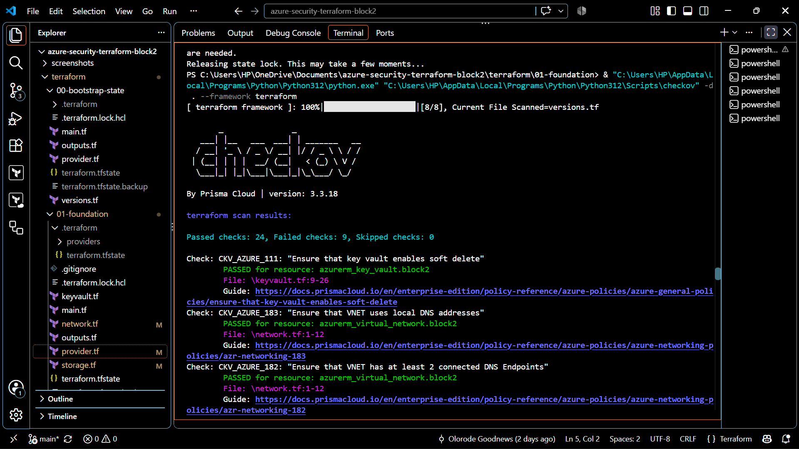

---

# 30. Additional NSG Remediation

I created an NSG for the private endpoint subnet after Checkov detected that the subnet had no NSG associated with it.

I applied the Terraform change and confirmed that the corresponding Checkov check passed during the next scan.

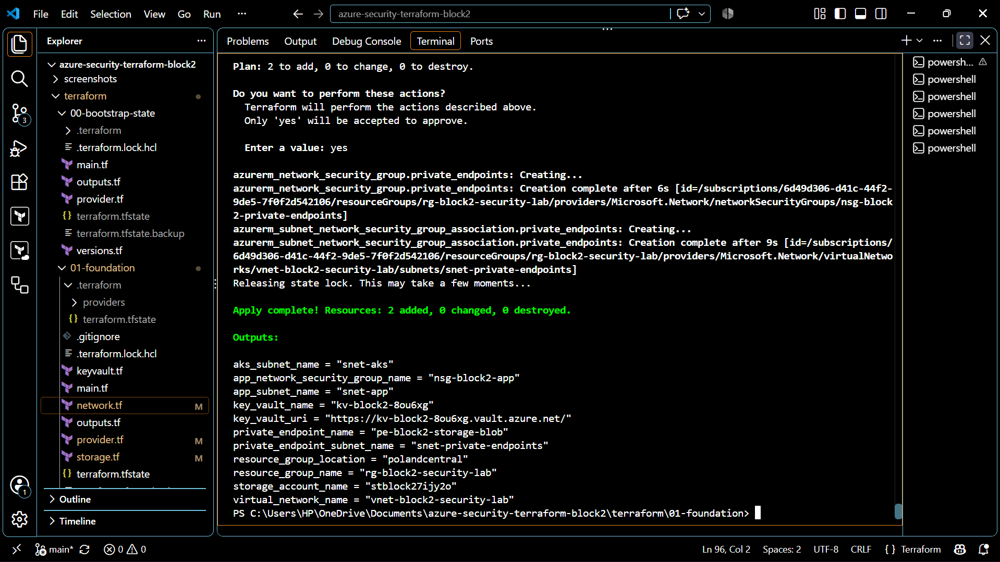

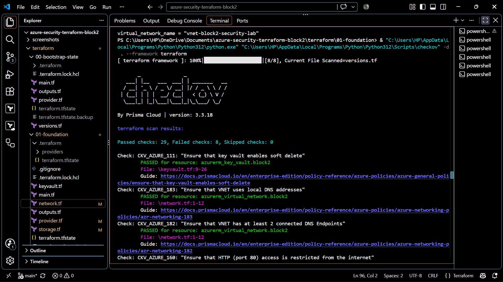

---

# 31. Documented Checkov Exceptions

Some Checkov findings were not appropriate to implement in this temporary student lab.

Instead of hiding them, I added scoped Checkov skip comments directly to the relevant Terraform resources and documented the reason for each exception.

Examples included Key Vault networking controls, purge protection, Storage replication, and customer-managed encryption that were not required for the temporary lab environment.

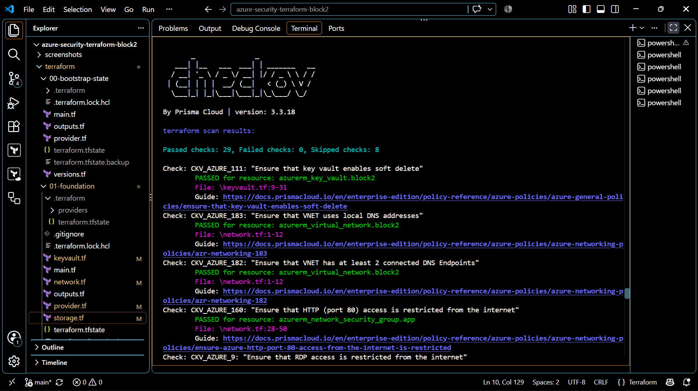

---

# 32. Checkov GitHub Actions Security Gate

I integrated Checkov into the GitHub Actions workflow.

I intentionally did not configure `--soft-fail`, which means any new unapproved Checkov security finding causes the CI pipeline to fail.

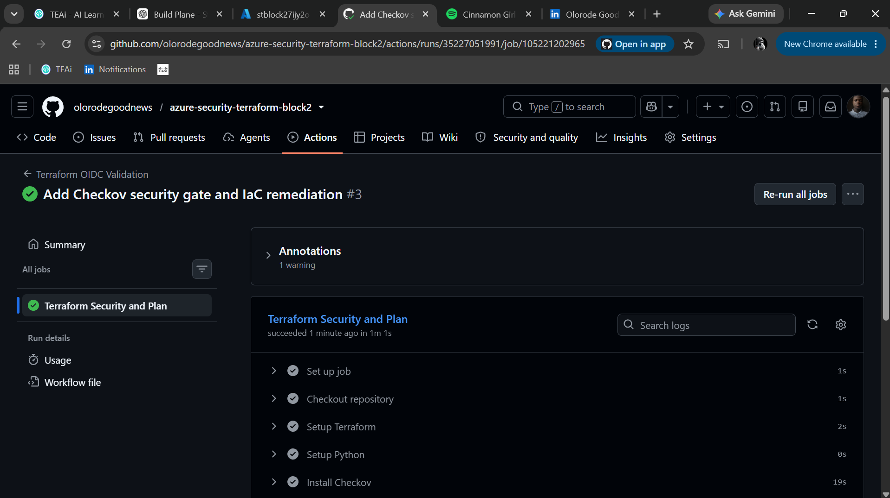

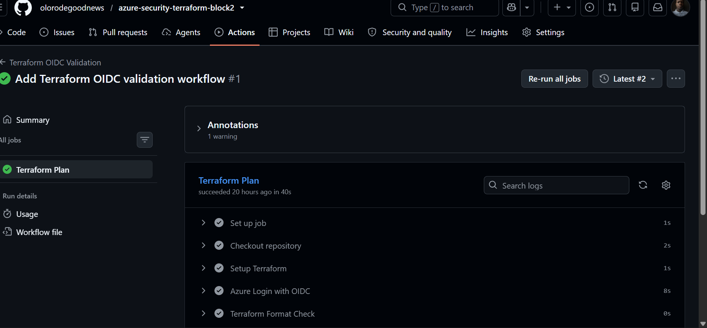

---

# 33. Trivy Infrastructure-as-Code Scanning

I integrated Trivy configuration scanning as a second Infrastructure-as-Code security scanner.

I configured Trivy to scan the Terraform directory and fail the GitHub Actions pipeline when High or Critical findings were detected.

---

# 34. Trivy Findings and Remediation

Trivy identified Critical findings relating to Azure Key Vault and Storage network configuration.

I remediated the Storage finding by configuring explicit Storage network rules with the default action set to `Deny`. I documented the Key Vault network finding as a temporary lab exception because the lab did not have a private runner or VPN path to the Key Vault.

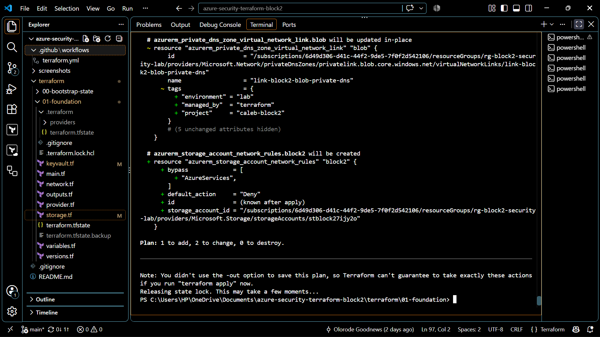

---

# 35. Final IaC Security Pipeline

After completing the Checkov and Trivy remediation work, I pushed the updated Terraform configuration to GitHub.

I confirmed that Checkov, Trivy, Azure OIDC authentication, Terraform validation, and Terraform planning all passed successfully in GitHub Actions.

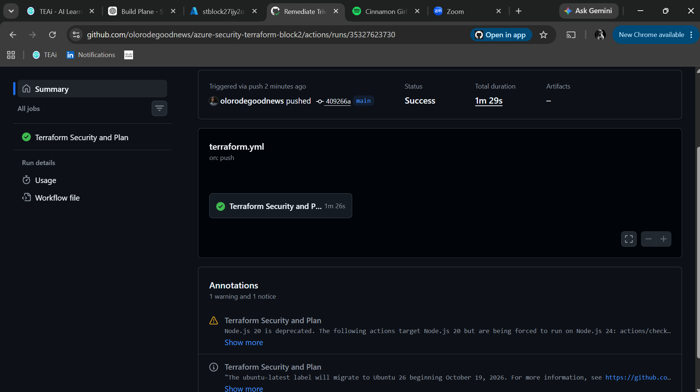

---

# 36. Azure Kubernetes Service

I deployed the AKS cluster:

`aks-block2-security-lab`

using Terraform.

I configured the cluster with the AKS Free tier and a single system node to reduce the amount of Azure student credit used by the temporary lab.

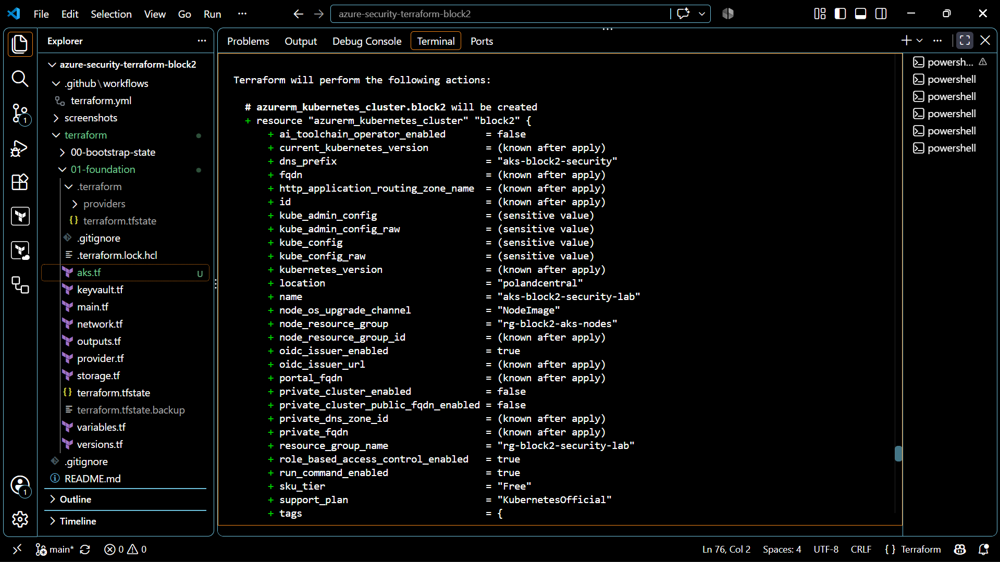

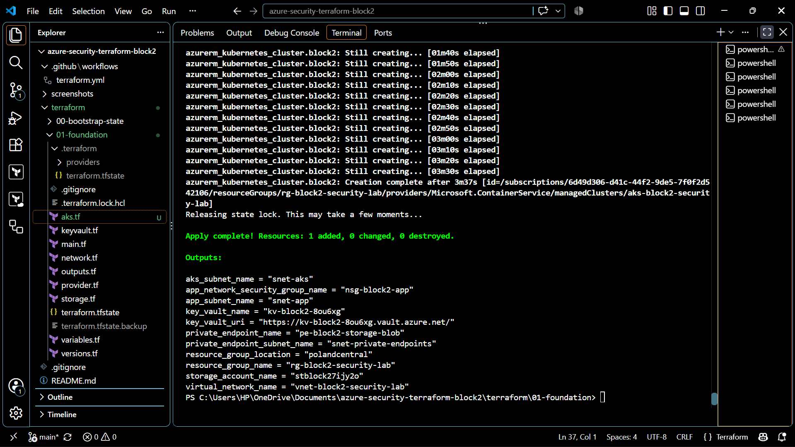

---

# 37. AKS Node Pool

I initially attempted to use `Standard_B2s`, but my Azure for Students subscription did not allow that VM SKU in Poland Central.

I changed the Terraform configuration to use `Standard_B2s_v2`, reapplied the configuration, and successfully deployed the AKS node pool.

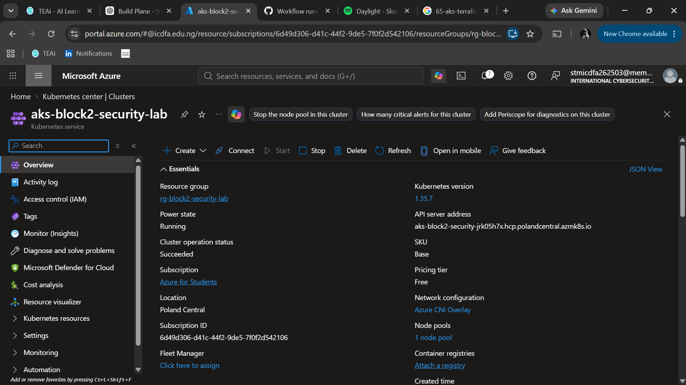

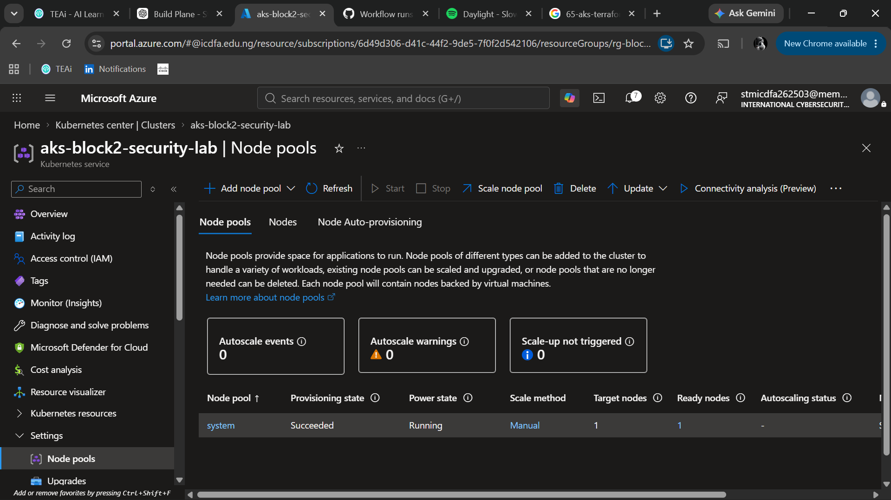

---

# 38. AKS CLI Validation

I installed `kubectl`, downloaded the AKS credentials using Azure CLI, and connected my local Kubernetes client to the cluster.

I ran:

`kubectl get nodes`

and confirmed that the AKS node reached the `Ready` state.

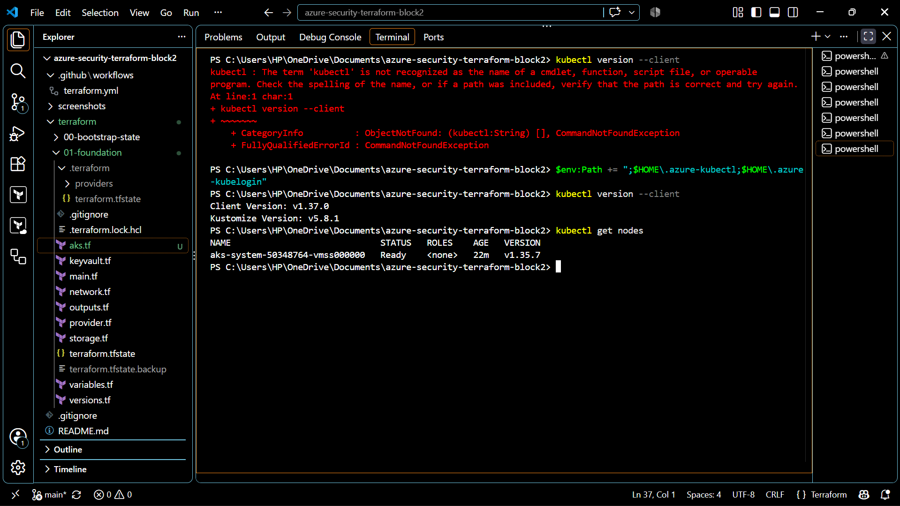

---

# 39. AKS OIDC, Workload Identity and RBAC

I enabled the AKS OIDC issuer, Workload Identity, and Kubernetes RBAC through Terraform.

I verified these settings using Azure CLI and confirmed that all three security features were enabled.

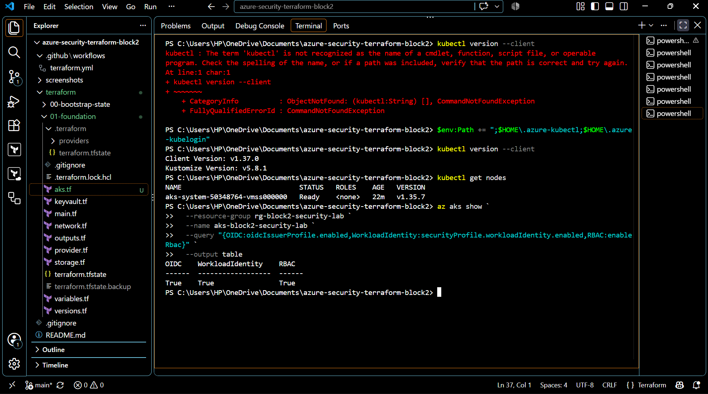

---

# 40. Kubernetes Test Workload

I created a Kubernetes Deployment containing an NGINX container to confirm that the AKS cluster could successfully schedule and run an application workload.

I configured CPU and memory requests and limits and deployed the workload using `kubectl apply`.

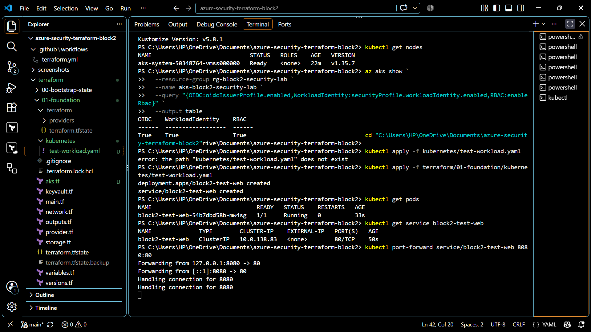

---

# 41. Internal ClusterIP Service

I created a Kubernetes `ClusterIP` Service for the test workload.

I deliberately used `ClusterIP` instead of a public `LoadBalancer` so that the application remained internal to the Kubernetes cluster and did not create an unnecessary public IP or Azure Load Balancer.

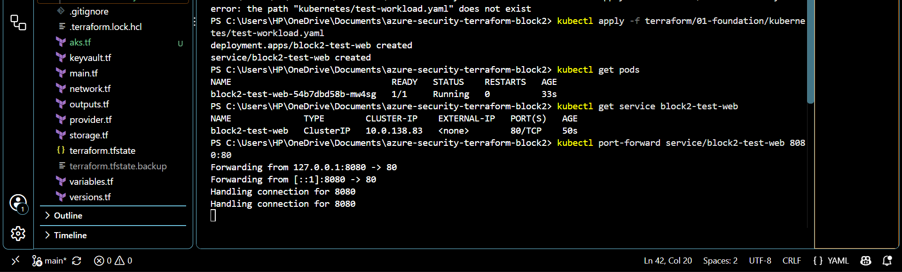

---

# 42. Application Validation

I used `kubectl port-forward` to securely forward traffic from my local system to the internal NGINX service.

I opened the forwarded localhost address in my browser and confirmed that the NGINX application was running successfully.

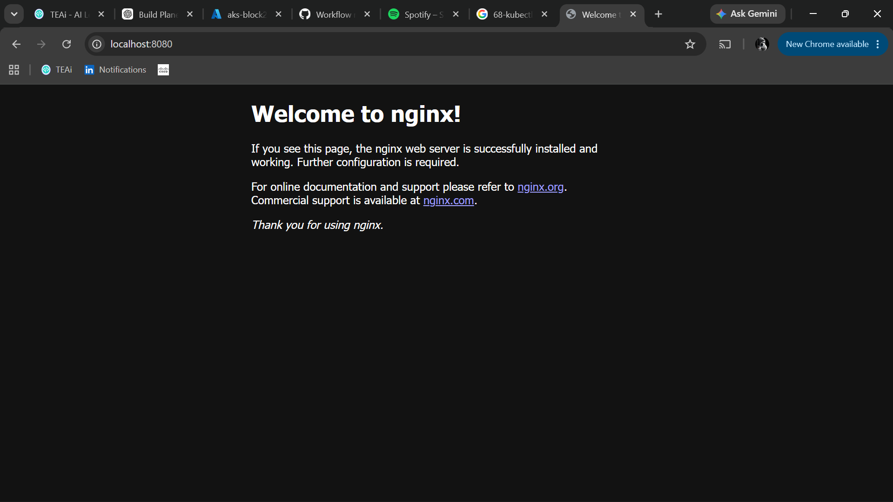

---

# 43. AKS Workload Managed Identity

I created a separate user-assigned managed identity for the Kubernetes workload using Terraform.

I used this identity specifically for workload authentication instead of giving the application access through the AKS control-plane identity.

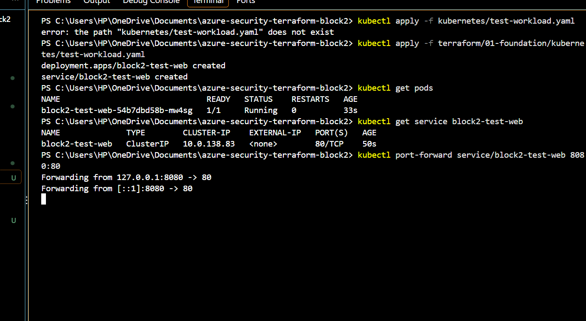

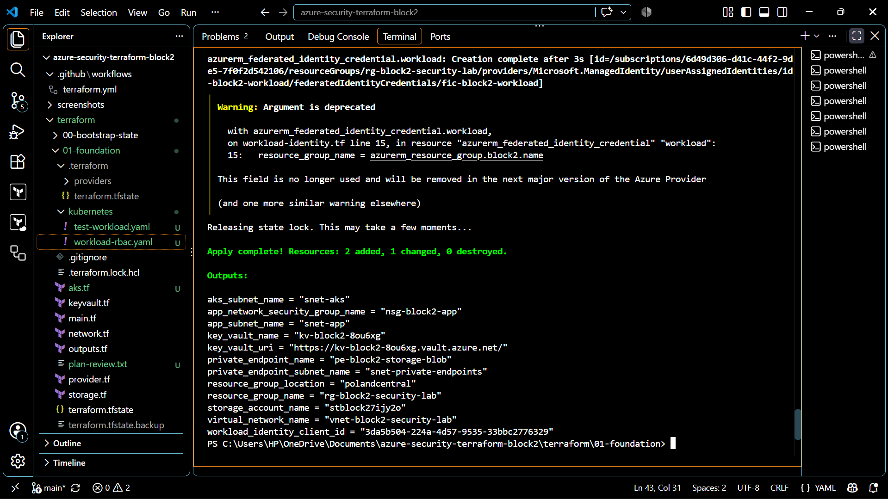

---

# 44. Federated Identity Credential

I created a federated identity credential in Terraform that trusts the AKS OIDC issuer.

I configured the federated subject as:

`system:serviceaccount:block2-app:block2-workload-sa`

This restricted the Azure identity trust to the specific Kubernetes Service Account inside the `block2-app` namespace.

---

# 45. Kubernetes Service Account

I created the Kubernetes Service Account:

`block2-workload-sa`

inside the `block2-app` namespace.

I annotated the Service Account with the Azure managed identity Client ID so that AKS Workload Identity could inject the required Azure identity information into compatible pods.

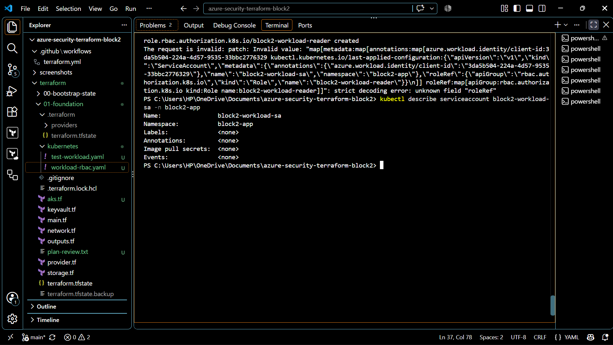

---

# 46. Kubernetes RBAC

I created a namespace-scoped Kubernetes `Role` and `RoleBinding`.

I allowed the workload Service Account to `get`, `list`, and `watch` selected resources such as pods, services, and ConfigMaps while avoiding unnecessary write or cluster-wide privileges.

---

# 47. Kubernetes RBAC Validation

I used `kubectl auth can-i` to verify the Service Account permissions.

I confirmed that the Service Account could read permitted resources inside `block2-app`, but could not delete pods or access resources in the `default` namespace.

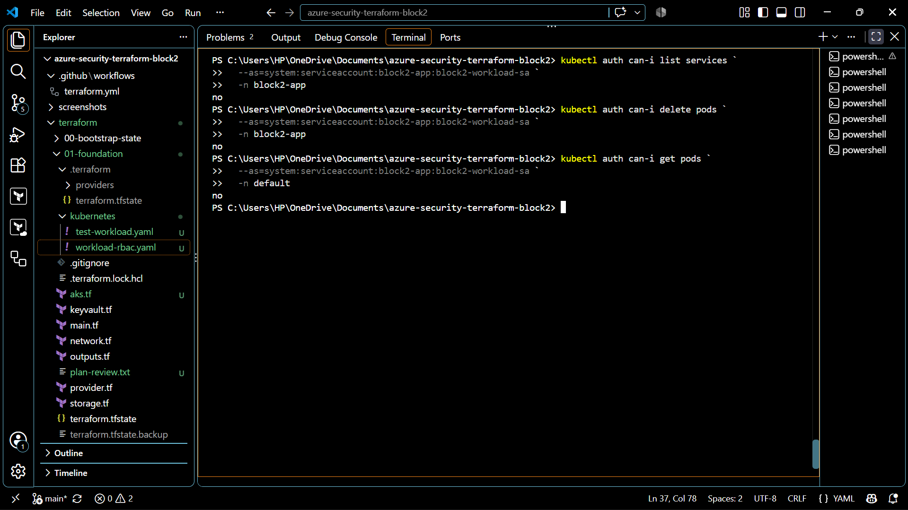

---

# 48. Key Vault Access for the Workload

I assigned the workload managed identity the Azure `Key Vault Secrets User` role using Terraform.

This allowed the workload to read Key Vault secret information without granting permissions to create, modify, or delete secrets.

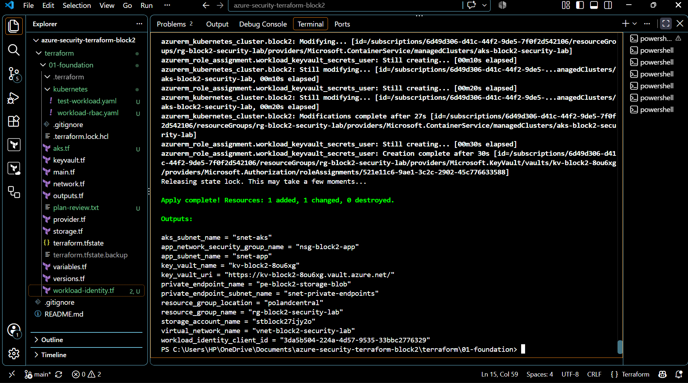

---

# 49. Secretless Azure Authentication

I deployed a test pod using the `block2-workload-sa` Service Account and enabled AKS Workload Identity for the pod.

Inside the pod, I authenticated to Azure using the projected federated token. I did not use or store a client secret, password, Storage key, or service-principal secret.

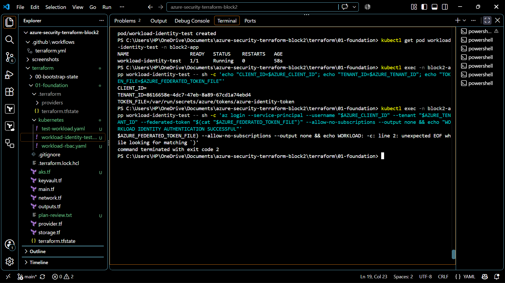

---

# 50. Workload Identity Key Vault Access

I used the authenticated workload to query the existing Key Vault.

The workload successfully listed the existing secret metadata, confirming that Azure recognized the Kubernetes workload identity and applied the assigned Key Vault RBAC role.

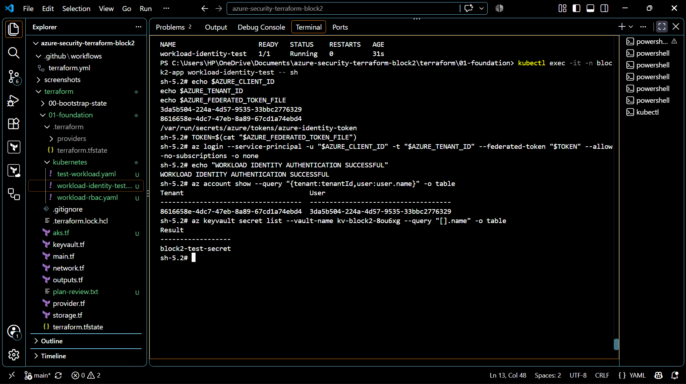

---

# 51. Key Vault Least-Privilege Validation

I attempted to create a new Key Vault secret from the workload identity.

Azure returned `Forbidden`, confirming that the workload had permission to read secret information but did not have permission to create or modify secrets.

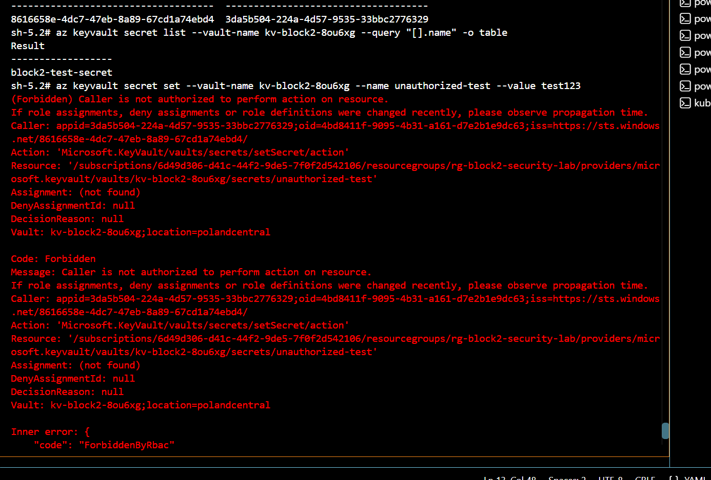

---

# 52. Cilium Network Policy Engine

I updated the AKS networking configuration using Terraform to enable Azure CNI Overlay with Cilium as the network data plane and NetworkPolicy engine.

Terraform showed an in-place AKS update with no resource destruction, and I applied the change.

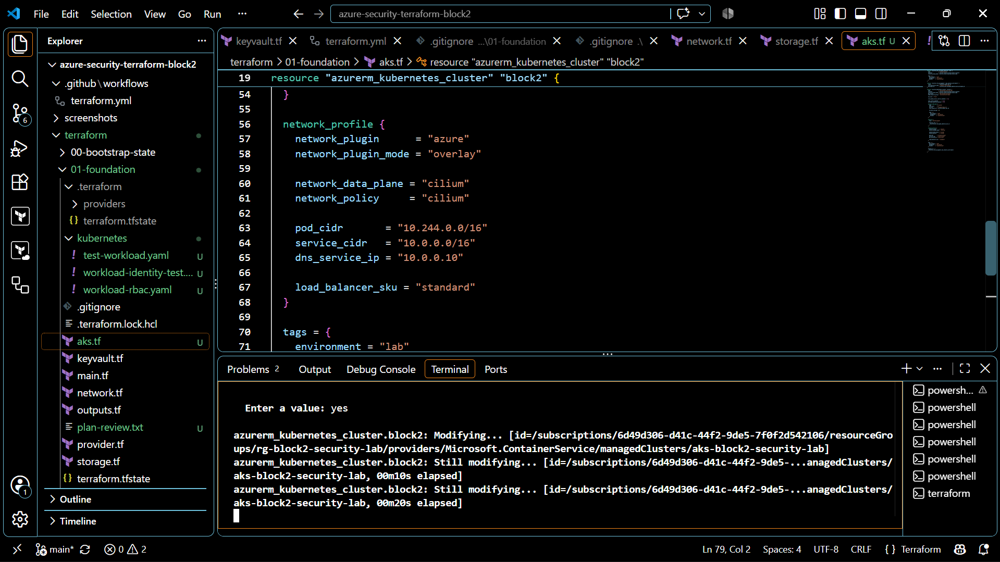

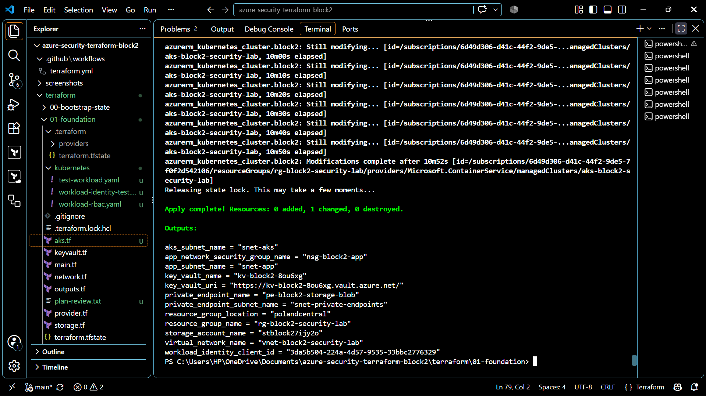

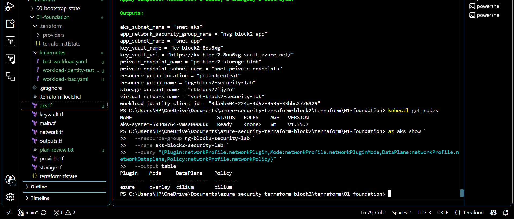

---

# 53. Kubernetes NetworkPolicy

I created a Kubernetes NetworkPolicy to control east-west communication between pods in the `block2-app` namespace.

I created an approved client pod, a blocked client pod, and a protected NGINX workload so that I could prove that Cilium was enforcing the policy.

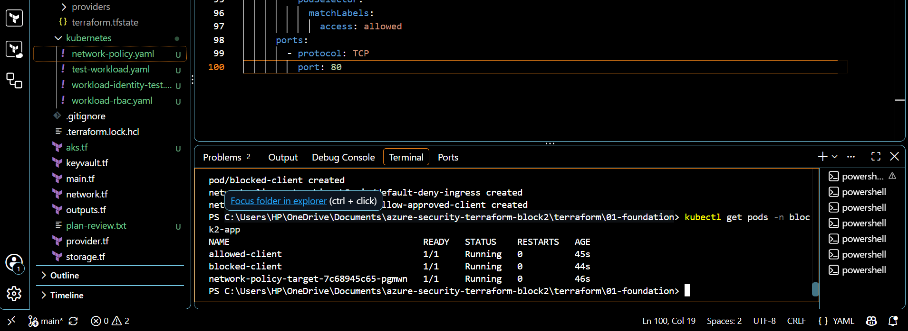

---

# 54. Allowed Network Traffic Test

I labelled the approved client pod with:

`access: allowed`

The NetworkPolicy permitted this pod to connect to the protected NGINX service on TCP port 80. I tested the connection and confirmed that the application returned the expected response.

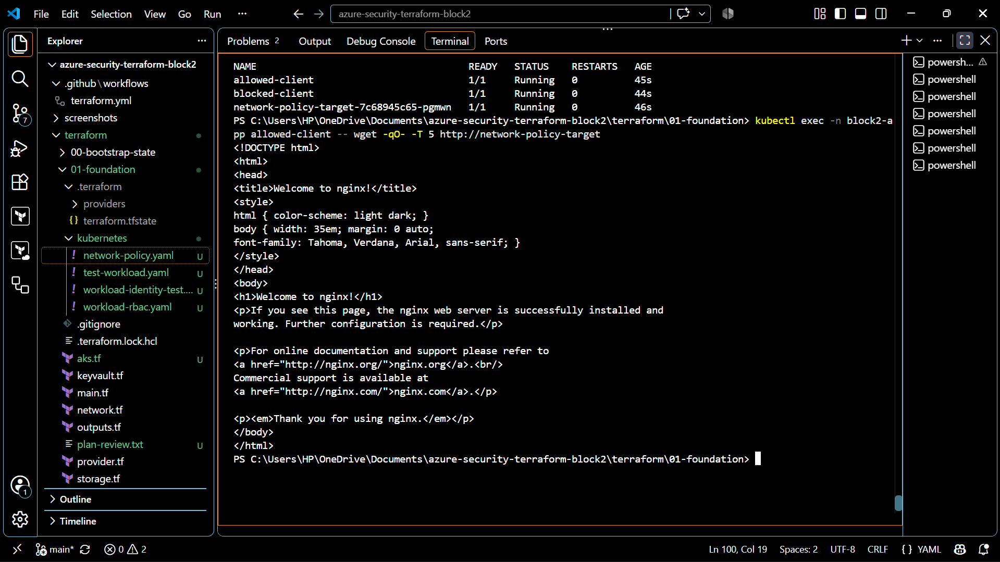

---

# 55. Blocked Network Traffic Test

I tested the same protected service from a pod that did not have the approved label.

The connection failed or timed out, confirming that Cilium was actively enforcing the NetworkPolicy and blocking unauthorized east-west communication.

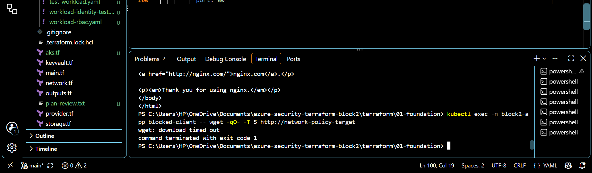

---

# 56. Custom Azure Policy — Deny

I created a custom Azure Policy definition using Terraform to deny Storage Accounts that have public network access enabled.

I assigned the policy to `rg-block2-security-lab` so that Storage resources in the project resource group would be required to follow the network security control.

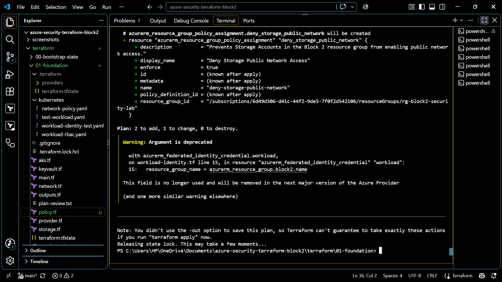

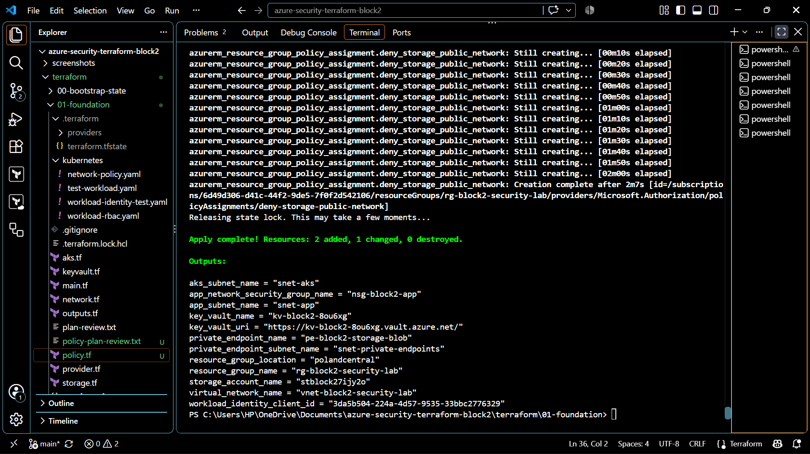

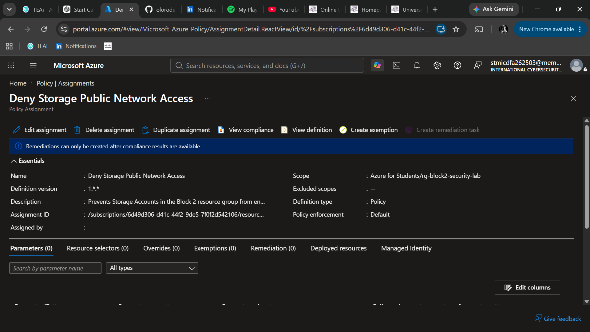

---

# 57. Azure Policy Deny Test

I deliberately attempted to deploy a Storage Account with public network access enabled inside the protected resource group.

Azure Policy denied the deployment, confirming that the custom policy was actively enforcing the required security configuration.

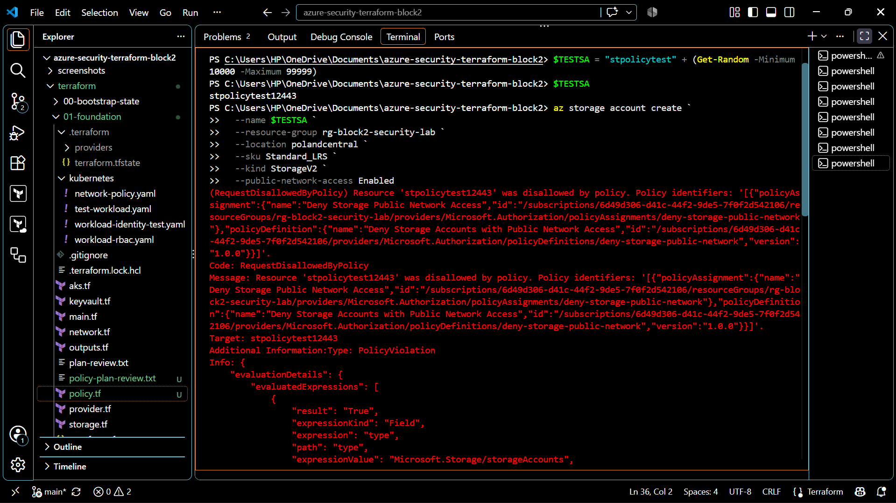

---

# 58. Log Analytics Workspace

I created the Log Analytics workspace:

`law-block2-security`

using Terraform.

I used this workspace as the monitoring destination for the Key Vault diagnostic logs deployed through my custom `DeployIfNotExists` Azure Policy.

---

# 59. DeployIfNotExists Policy

I created a second custom Azure Policy using the `DeployIfNotExists` effect.

The policy checks Key Vault resources for the required diagnostic setting and automatically deploys the setting when it is missing.

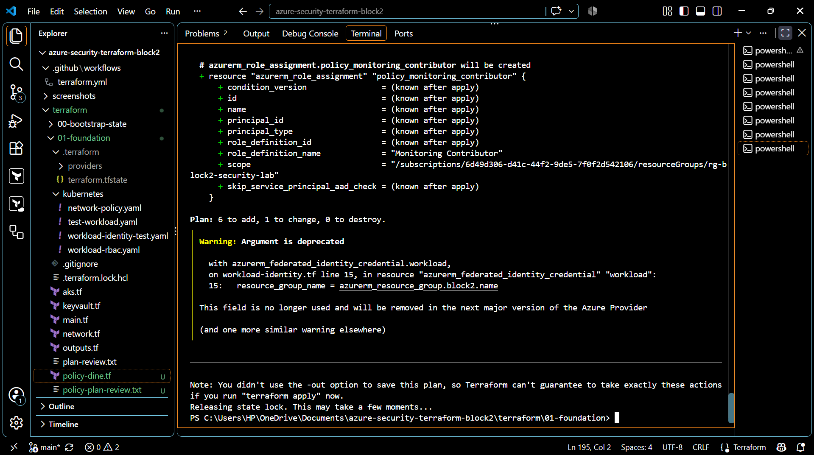

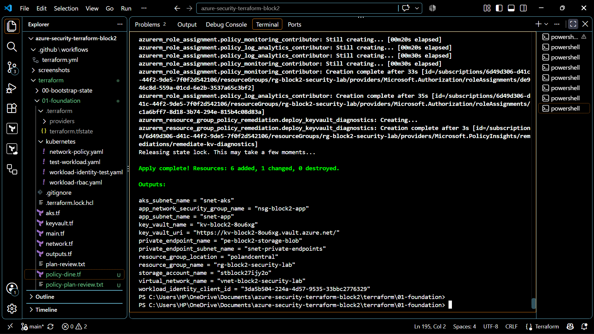

---

# 60. Policy Managed Identity and RBAC

I configured the `DeployIfNotExists` policy assignment with a system-assigned managed identity.

I assigned the policy identity the `Monitoring Contributor` and `Log Analytics Contributor` roles so that it had the permissions required to deploy diagnostic settings and connect them to the Log Analytics workspace.

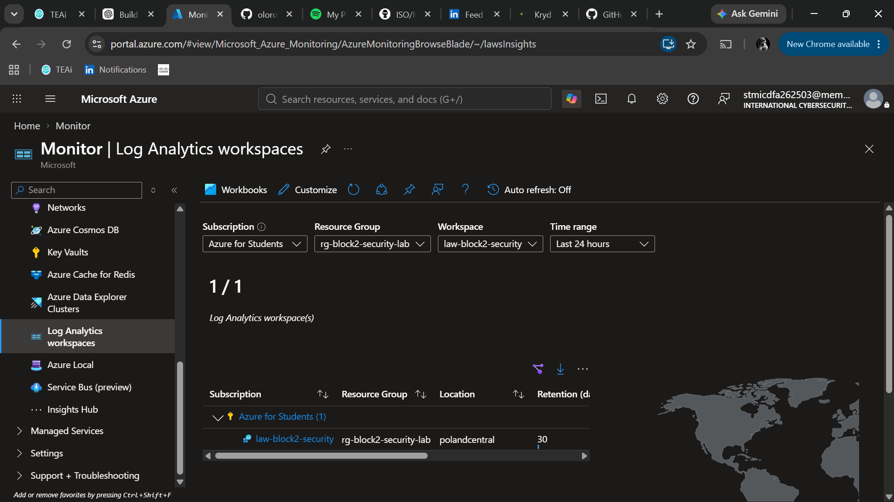

---

# 61. Azure Policy Remediation

I created an Azure Policy remediation task using Terraform with resource discovery configured to reevaluate compliance.

This allowed Azure Policy to remediate the Key Vault that already existed before the policy assignment instead of applying the configuration only to newly created resources.

---

# 62. Key Vault Diagnostic Settings

After the remediation completed, I verified the Key Vault diagnostic settings using Azure CLI.

I confirmed that Azure Policy had automatically created:

`setbypolicy-kv-logs`

and connected the Key Vault diagnostics to my Log Analytics workspace.

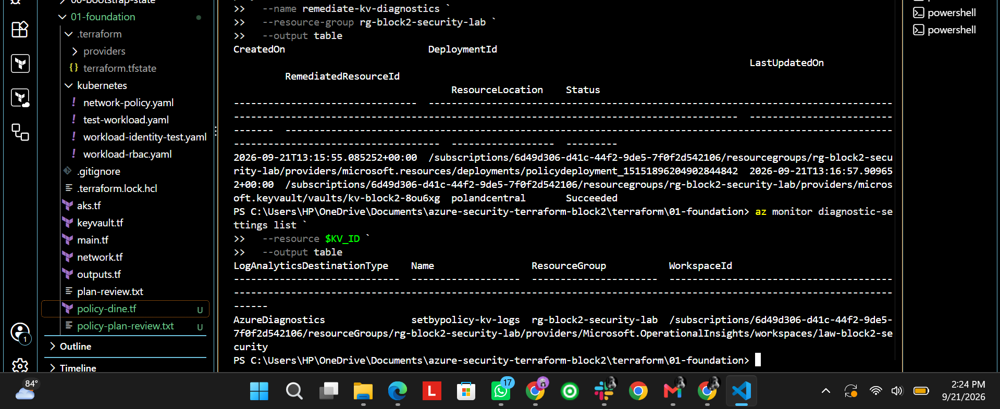

---

# 63. Microsoft Defender for Cloud

I reviewed Microsoft Defender for Cloud to evaluate the security posture of the Azure environment.

I reviewed the recommendations relating to the resources created in this project and used Defender for Cloud as an additional security-assessment layer rather than enabling unnecessary paid plans simply for the lab.

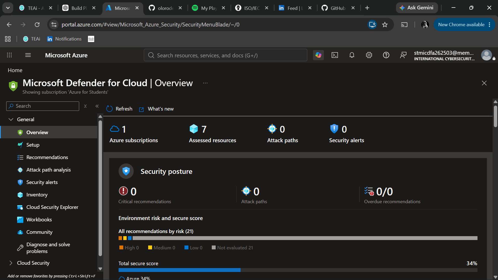

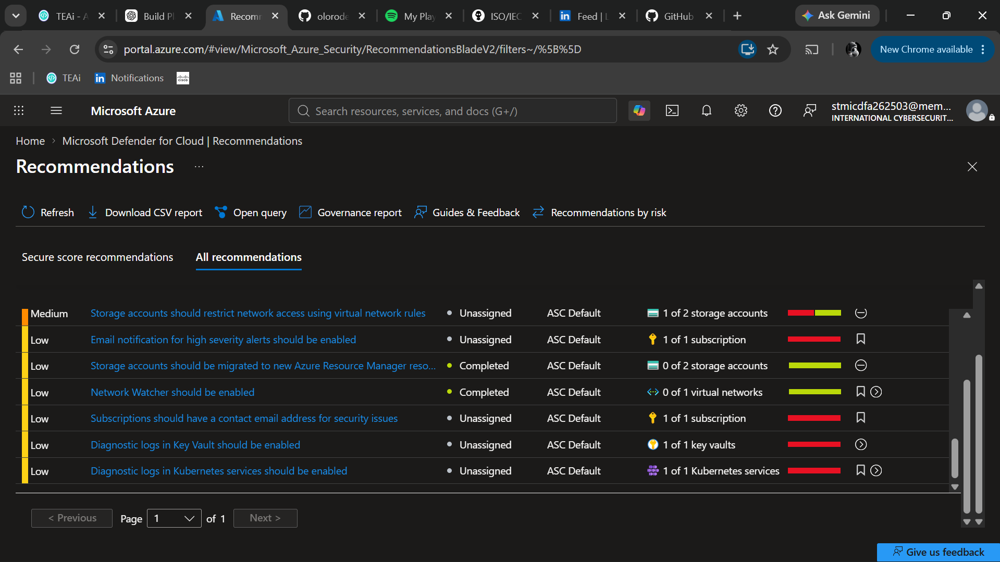

---

# 64. Secure Score

I reviewed the Secure Score for my Azure for Students subscription and captured the baseline security posture.

I used the recommendations to understand which Azure controls could improve the environment and compared them with the security controls I had already implemented through Terraform and Azure Policy.

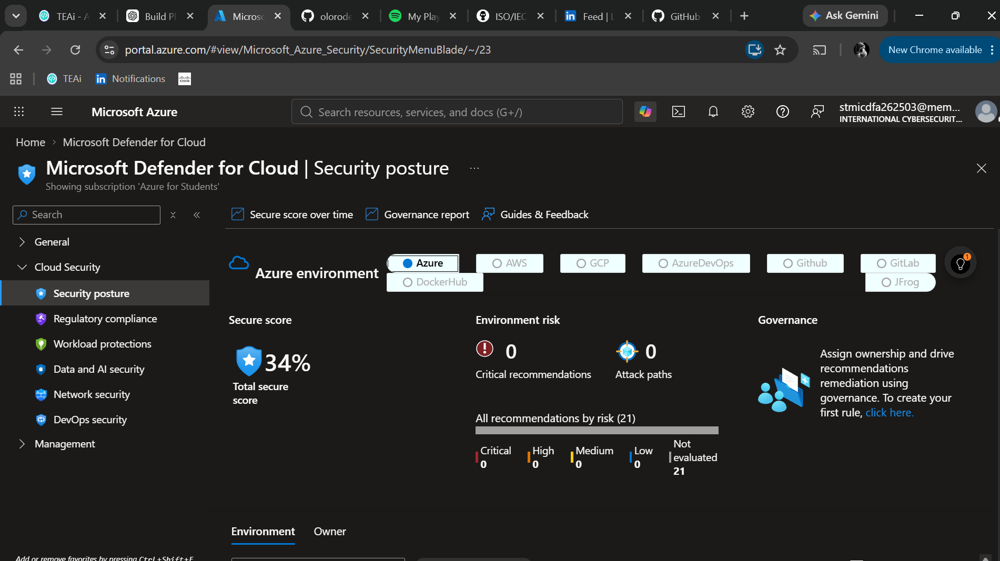

---

# 65. Defender Recommendation Review

After implementing the Policy-as-Code and diagnostic logging controls, I reviewed Defender for Cloud again to check the updated resource security posture.

Where reassessment information was available, I compared the result with my earlier Defender baseline.

---

# 66. Final Terraform Drift Check

At the end of the implementation, I ran:

`terraform plan`

against the deployed environment.

I used this final check to confirm that the Azure infrastructure matched my Terraform configuration and that there was no unexpected configuration drift.

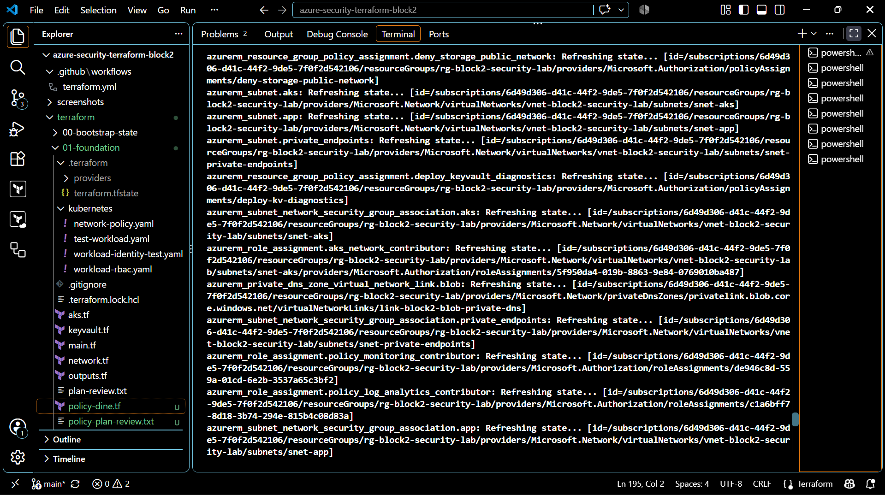

---

# 67. Final GitHub Repository

I stored the Terraform configuration, Kubernetes manifests, GitHub Actions workflow, documentation, and implementation evidence in GitHub.

I kept Terraform state files, `.terraform` directories, sensitive variable files, temporary plan files, and provider binaries out of the repository using `.gitignore`.

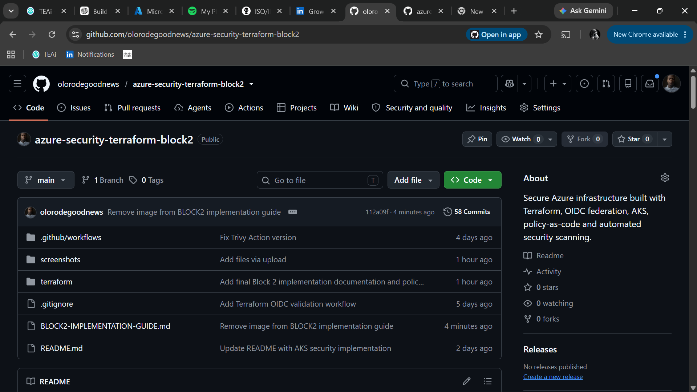

---

# Security Architecture Summary

Through this project, I implemented multiple layers of Azure and Kubernetes security.

I used Terraform to manage the infrastructure, Azure RBAC to manage permissions, Private Link to reduce public exposure, GitHub OIDC to remove CI/CD client secrets, AKS Workload Identity to remove application client secrets, Checkov and Trivy to scan Infrastructure as Code, Cilium to enforce Kubernetes NetworkPolicy, Azure Policy to enforce governance controls, and Log Analytics and Defender for Cloud for monitoring and security posture review.

---

# Key Security Controls Implemented

- Azure Infrastructure deployed with Terraform
- Secure Terraform remote state
- Azure RBAC authentication
- Shared Key authentication disabled
- Azure Storage public access disabled
- Private Endpoint connectivity
- Private DNS
- Network Security Groups
- Azure Key Vault
- GitHub Actions OIDC
- User-assigned managed identities
- Checkov security scanning
- Trivy security scanning
- CI/CD security gates
- Azure Kubernetes Service
- Kubernetes RBAC
- AKS OIDC
- AKS Workload Identity
- Federated identity credentials
- Secretless workload authentication
- Key Vault least-privilege access
- Azure CNI Overlay
- Cilium
- Kubernetes NetworkPolicy
- Azure Policy-as-Code
- Custom Deny policy
- DeployIfNotExists policy
- Policy remediation
- Log Analytics
- Key Vault diagnostic logging
- Microsoft Defender for Cloud
- Terraform drift validation

---

# Project Cleanup

I treated the AKS environment as temporary infrastructure because the cluster node consumes Azure student credit.

After completing the configuration, testing, screenshots, and GitHub documentation, I planned to remove the temporary AKS compute resources while keeping the Terraform configuration in GitHub.

This allows me to recreate the secured AKS environment later without continuously paying for the running compute resources.

---

# Conclusion

This project allowed me to move beyond manually creating Azure resources and instead build a repeatable security-focused Azure environment using Infrastructure as Code.

I implemented security across identity, networking, Storage, secrets management, CI/CD, Kubernetes, governance, monitoring, and policy enforcement. I also validated the controls through practical tests such as denied Storage deployments, restricted Kubernetes permissions, blocked pod traffic, secretless Workload Identity authentication, denied Key Vault writes, Infrastructure-as-Code scanning, and Azure Policy remediation.

The completed Terraform and Kubernetes configuration remains version-controlled in GitHub so that the environment can be reviewed, improved, and recreated when required.